# zig-3270 Architecture

Comprehensive system design documentation for the TN3270 emulator implementation.

## System Overview

The system follows a **layered architecture** with clear separation of concerns. Each layer has well-defined responsibilities and minimal coupling to other layers.

```mermaid
graph TD
    subgraph "Application Layer<br/>(user interaction, main loop, client control)"
        A1[main.zig]
        A2[emulator.zig]
        A3[root.zig]
        A4[client.zig]
        A5[client_example.zig]
        A6[ghostty_vt_terminal.zig]
        A7[ghostty_vt_example.zig]
        A8[integration_test.zig]
    end

    subgraph "Domain Layer<br/>(screen model, fields, terminal state)"
        D1[domain_layer.zig]
        D2[screen.zig]
        D3[field.zig]
        D4[terminal.zig]
        D5[executor.zig]
        D6[data_entry.zig]
        D7[field_cache.zig]
        D8[field_storage.zig]
        D9[screen_history.zig]
        D10[session_storage.zig]
    end

    subgraph "Protocol Layer<br/>(TN3270 data stream, command parsing)"
        P1[protocol_layer.zig]
        P2[protocol.zig]
        P3[parser.zig]
        P4[parser_optimization.zig]
        P5[stream_parser.zig]
        P6[command.zig]
        P7[parse_utils.zig]
    end

    subgraph "Network Layer<br/>(TCP connections, telnet negotiation)"
        N1[network_resilience.zig]
        N2[mock_server.zig]
        N3[client_test.zig]
    end

    subgraph "Utility Layer<br/>(hex viewer, keyboard mapping, attributes)"
        U1[attributes.zig]
        U2[ansi_colors.zig]
        U3[ebcdic.zig]
        U4[debug_log.zig]
        U5[error_context.zig]
        U6[hex_viewer.zig]
        U7[hex_viewer_example.zig]
        U8[input.zig]
        U9[keyboard_config.zig]
        U10[profiler.zig]
        U11[renderer.zig]
        U12[benchmark.zig]
        U13[benchmark_enhanced.zig]
        U14[benchmark_optimization_impact.zig]
        U15[buffer_pool.zig]
        U16[allocation_tracker.zig]
        U17[ghostty_vt_visual_test.zig]
    end

    A1 --> D1
    A2 --> D1
    A3 --> D1
    A4 --> D1
    D1 --> P1
    P1 --> N1
    N1 --> U1
```



```
┌──────────────────────────────────────────────────┐
│  Application Layer                               │
│  (user interaction, main loop, client control)   │
├──────────────────────────────────────────────────┤
│  Domain Layer                                    │
│  (screen model, fields, terminal state)          │
├──────────────────────────────────────────────────┤
│  Protocol Layer                                  │
│  (TN3270 data stream, command parsing)           │
├──────────────────────────────────────────────────┤
│  Network Layer                                   │
│  (TCP connections, telnet negotiation)           │
├──────────────────────────────────────────────────┤
│  Utility Layer                                   │
│  (hex viewer, keyboard mapping, attributes)      │
└──────────────────────────────────────────────────┘
```

## Layer Descriptions

### Layer 1: Application (main.zig, client.zig)

**Purpose**: Orchestrates high-level functionality and user interaction.

**Responsibilities**:
- Application entry point
- Module initialization and lifecycle management
- Client connection management
- Main event loop (future)

**Key Types**:
- `Client`: Connection manager for mainframe sessions
  - `host`: Hostname or IP address
  - `port`: Port number (typically 3270)
  - `connect()`: Establish connection
  - `send_command()`: Send AID and data

**Dependencies**: All domain modules (screen, terminal, field, etc.)

**Status**: Basic functionality complete; event loop pending

---

### Layer 2: Domain (screen.zig, field.zig, terminal.zig, executor.zig, data_entry.zig)

**Purpose**: Models the logical 3270 terminal state and behavior.

**Responsibilities**:
- Screen buffer management
- Field definitions and input handling
- Terminal state machine
- Keyboard-to-AID mapping
- Command execution

#### Core Modules

**screen.zig** - Screen Buffer Model
- Two-dimensional character buffer (rows × cols)
- 24×80 standard 3270 format (configurable)
- Character read/write operations
- Screen clearing and area operations

**field.zig** - Field Management
- Protected/unprotected field regions
- Field attribute handling
- Input validation (numeric-only, etc.)
- Field traversal and focus management

```zig
pub struct {
    start: u16,        // Byte offset in screen buffer
    length: u16,       // Field length in characters
    protected: bool,   // User editable?
    hidden: bool,      // Display in output?
    numeric: bool,     // Numeric-only input?
    attributes: u8,    // Additional attributes
}
```

**terminal.zig** - Terminal State Machine
- Current cursor position
- Active field focus
- Display mode state
- Write mode (insert vs. replace)
- Renders output using renderer.zig

**executor.zig** - Command Execution
- Processes 3270 order codes
- Routes to appropriate handlers
- State validation

**data_entry.zig** - AID Processing
- AID (Attention Identifier) mapping
- Data field extraction
- Read Modified Fields (RMF) response formatting

#### Data Flow

```
Network Data → Parser → Executor → Domain Model
                          ↓
                     Field Manager
                     Screen Buffer
                        Terminal
                          ↓
                      Renderer → Visual Output
```

---

### Layer 3: Protocol (protocol.zig, parser.zig, stream_parser.zig, command.zig)

**Purpose**: Implements the TN3270 data stream protocol.

**Responsibilities**:
- Define protocol constants and structures
- Parse inbound data streams
- Format outbound commands
- Handle protocol state

#### Core Modules

**protocol.zig** - Protocol Definitions
- Command codes (Write, Read Modified, Erase Write)
- Order codes (Set Buffer Address, Start Field, Set Attribute)
- Field attributes (protected, numeric, hidden, etc.)
- Address encoding/decoding

```zig
pub const CommandCode = enum(u8) {
    write = 0x01,
    read_modified = 0x06,
    erase_write = 0x05,
    // ...
};

pub const OrderCode = enum(u8) {
    set_buffer_address = 0x11,
    start_field = 0x1D,
    set_attribute = 0x28,
    // ...
};
```

**parser.zig** - Inbound Stream Parser
- Parses Write commands
- Extracts order codes and data
- Validates buffer addresses
- Single-pass parsing for efficiency

**stream_parser.zig** - Streaming Parser
- Handles partial data chunks
- Maintains parser state across reads
- Buffering for incomplete commands

**command.zig** - Outbound Command Builder
- Formats Read Modified Field responses
- Constructs Write commands
- Encodes field data with attributes
- Proper byte ordering

#### Protocol State Machine

```
CONNECT → NEGOTIATE TELNET → RECEIVE ERASE WRITE/WRITE → PARSE DATA
                                       ↓
                              UPDATE SCREEN & FIELDS
                                       ↓
                                WAIT FOR INPUT
                                       ↓
                        USER PRESSES ENTER/FUNCTION KEY
                                       ↓
                         FORMAT & SEND READ MODIFIED
                                       ↓
                                    LOOP
```

---

### Layer 4: Network (connection.zig, telnet.zig, mock_server.zig)

**Purpose**: Handles TCP connections and telnet negotiation.

**Responsibilities**:
- TCP socket management
- Non-blocking I/O
- Telnet IAC command handling
- Connection pooling/reuse
- Error recovery

**Key Features**:
- Automatic reconnection on disconnect
- Telnet WILL/DO/WONT negotiation
- Support for multiple connections (future)

---

### Layer 5: Utilities (hex_viewer.zig, input.zig, attributes.zig, renderer.zig)

**Purpose**: Support tools and helpers.

#### hex_viewer.zig - Protocol Debugger
- Side-by-side hex and ASCII display
- Configurable bytes per line
- Row/column numbering
- Useful for protocol troubleshooting

#### input.zig - Keyboard Input
- Maps keyboard input to 3270 AIDs
- Handles function keys
- Macro support (future)

#### attributes.zig - Field Attributes
- Attribute parsing and formatting
- Color support (future)
- Bold, underline (future)

#### renderer.zig - Visual Rendering
- Converts screen buffer to displayable format
- Handles field highlighting
- ANSI escape sequences (future)

---

## Module Dependency Graph

```
main.zig (orchestrator)
  ├── client.zig (user-facing)
  ├── screen.zig (buffer)
  ├── terminal.zig (state)
  │   ├── screen.zig
  │   └── renderer.zig
  ├── field.zig (field mgmt)
  │   ├── screen.zig
  │   └── attributes.zig
  ├── parser.zig (inbound)
  │   ├── protocol.zig
  │   └── executor.zig
  ├── stream_parser.zig (streaming)
  │   └── parser.zig
  ├── executor.zig (command exec)
  │   ├── protocol.zig
  │   ├── screen.zig
  │   └── terminal.zig
  ├── command.zig (outbound)
  │   ├── protocol.zig
  │   └── data_entry.zig
  ├── data_entry.zig (AID handling)
  │   └── protocol.zig
  ├── input.zig (keyboard)
  │   └── protocol.zig
  ├── hex_viewer.zig (debug tool)
  └── ghostty_vt_terminal.zig (VT integration)
      └── screen.zig
```

## Data Flow Examples

### Screen Update Flow (Receiving Data)

```
Network Socket
    ↓
stream_parser.zig (buffer management)
    ↓
parser.zig (extract commands/orders)
    ↓
executor.zig (process orders)
    ↓
screen.zig (write_char, write_string)
    ↓
terminal.zig (update state)
    ↓
renderer.zig (format output)
    ↓
Display/Terminal
```

### User Input Flow (Sending Data)

```
User Input (keyboard)
    ↓
input.zig (map to AID)
    ↓
data_entry.zig (format response)
    ↓
command.zig (encode command)
    ↓
Network Socket
```

## Key Design Patterns

### 1. Layered Architecture
- Each layer is independent and testable
- Lower layers know nothing of upper layers
- Clear contracts between layers

### 2. State Machine
- Terminal maintains logical state
- Executor validates state transitions
- Parser is stateless within a frame

### 3. Memory Management
- All modules use explicit allocators
- Arena allocators for temporary data
- Deterministic cleanup via `defer`

### 4. Error Handling
- Error union types (`Type!Error`)
- `try` for error propagation
- Explicit error cases with meaningful names

### 5. Single Responsibility
- Each module has one clear purpose
- Functions do one thing well
- Testability by design

## Testing Strategy

### Unit Tests (60+ tests)
- Test individual functions in isolation
- Mock dependencies when needed
- Cover happy paths and error cases

### Integration Tests (future)
- Test layer interactions
- Full screen update cycles
- Parser → executor → screen flow

### Example Usage
```zig
// Parser test: validate order parsing
const bytes = [_]u8{ 0x11, 0x40, 0x50, 'A', 'B' };
const result = try Parser.parse(&bytes);
try std.testing.expect(result.order_code == OrderCode.set_buffer_address);

// Screen test: write character
var scr = try Screen.init(allocator, 24, 80);
defer scr.deinit();
try scr.write_char(0, 0, 'X');
try std.testing.expect(try scr.read_char(0, 0) == 'X');
```

## Future Refactoring

### Priority 1: Decouple main.zig
**Current**: main.zig imports all 18 modules directly
**Goal**: Create facade/adapter layer to reduce coupling
**Effort**: 4-6 hours
**Benefit**: Easier testing, cleaner dependency graph

### Priority 2: Extract Utilities
**Current**: Parsing logic duplicated across modules
**Goal**: Create `utils/` package with shared functions
**Effort**: 2-3 hours
**Benefit**: Reduced duplication, consistent behavior

### Priority 3: Formalize Layer Boundaries
**Current**: Some cross-layer dependencies
**Goal**: Enforce strict layering with compile-time checks
**Effort**: 3-4 hours
**Benefit**: Architectural clarity, better maintainability

## Performance Considerations

### Current Optimizations
- Single-pass parser (no buffering before parse)
- Direct screen buffer writes (no intermediate representation)
- Reusable field and attribute buffers
- Stack allocation for small fixed-size data

### Future Optimizations
- Cursor-based screen updates (dirty rectangles)
- Parser state machine precompilation
- Memory pool for frequently allocated objects
- Profile-guided hot path optimization

## Configuration Points

### Screen Dimensions
```zig
// Standard 3270: 24 rows × 80 columns
const rows = 24;
const cols = 80;
```

### Field Attributes
```zig
pub const FieldAttribute = packed struct {
    protected: bool,
    numeric: bool,
    hidden: bool,
    intensified: bool,
    modified: bool,
    reserved: u3,
};
```

### Keyboard Mappings
Defined in `input.zig`, customizable per user preference.

---

## Related Documentation

- [README.md](../README.md) - Project overview and quick start
- [TODO.md](../TODO.md) - Roadmap and priorities
- [HEX_VIEWER.md](HEX_VIEWER.md) - Hex viewer tool documentation
- [GHOSTTY_INTEGRATION.md](GHOSTTY_INTEGRATION.md) - VT integration details

---

## Glossary

- **AID**: Attention Identifier—key code sent to mainframe
- **3270**: IBM terminal protocol (EBCDIC-based)
- **TN3270**: Telnet 3270—3270 over TCP/IP
- **RMF**: Read Modified Fields—request only changed data
- **Order Code**: Instruction in 3270 data stream
- **Field**: Protected or unprotected input area on screen
- **Buffer Address**: 2-byte position encoding in 3270 format
